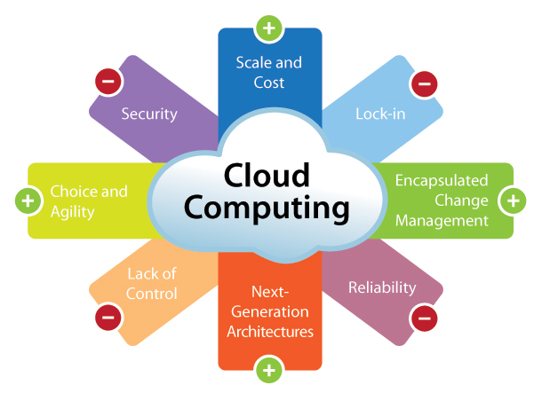

# Choix du personnage

## Critères

|                            |     IAAS Knigth     |     PAAS Ninja      |      PAAS Robot     |  FAAS and Furious   |
|--------------------------- |---------------------|---------------------|---------------------|---------------------|
| Coût infrastructure        |        ++           |        +++          |         +++         |         ++++        |
| Customisation              |        ++++         |        +            |         ++          |         +           |
| Facilité de mise en place  |        +            |        +++          |         ++          |         ++++        |
| Scalabilité                |        ++           |        +++          |         ++++        |         +++         |
| Maintenance                |        ++           |        +++          |         +++         |         ++++        |
| Indépendance               |        ++++         |        ++++         |         +++         |         +           |
| Stratégie de déploiement   |        +            |        +++          |         ++++        |         +++         |

**Remarques :**
* Cout : Notation haute = Faible coût
* Stratégie de déploiement : Notation haute = multiples stratégies facilement accessibles


## Aides

<center>

    

    

    

    

</center>

### La calculette 

[PricingCalculator](https://azure.microsoft.com/en-us/pricing/calculator/)

## Détails

### IAAS Knight - Azure VM

Instructions du jeu [ici](instructions_iaas_knight.md)


### PAAS Robot - Azure Container Service

*Azure Container Service* est un environnement d'exécution de container Docker qui se base entièrement sur l'orchestrateur Kubernetes. A la croisée entre le PAAS (Plateform As A Service) et un nouveau concept appelé le CAAS (Container As A Service). Redoutable pour gérer finement la scalabilité d'une application et gérer des problématiques de déploiement tels que : A/B Testing, Blue/Green Deployment ou Infrastructure immuable.
[Azure Container Service](https://azure.microsoft.com/fr-fr/services/container-service/)

[Fonctionnement de Azure Container Service avec Kubernetes](https://docs.microsoft.com/en-us/azure/container-service/kubernetes/container-service-kubernetes-walkthrough)

Instructions du jeu [ici](instructions_paas_robot.md)


### PAAS Ninja - App Service Web Apps 

*App Service Web Apps* est une plateforme de calcul entièrement gérée, optimisée pour l’hébergement de sites et d’applications web. Cette offre PaaS (Plateforme en tant que service) de Microsoft Azure vous permet de donner la priorité à votre logique métier tandis qu’Azure gère l’infrastructure servant à exécuter et à faire évoluer vos applications.
[App Service Web Apps ](https://azure.microsoft.com/fr-fr/services/app-service/web/)

[Fonctionnement d’App Service](https://docs.microsoft.com/fr-fr/azure/app-service/app-service-how-works-readme)

Instructions du jeu [ici](instructions_paas_ninja.md)

```
* App Services -> Ajouter -> Node JS Empty Web App
* Regarder le code source, tester l'excecution
* Dans Options de déploiement -> Deconnecter le github 'sample'
* Dans Options de déploiement -> Configurer un git local
* Dans propriété recuperer le git azure correspondant
* Clone, edit, commit & test
```


### FAAS and Furious - Azure Functions

*Azure Functions* vous permet d’exécuter votre code dans un environnement sans serveur et sans avoir à créer une machine virtuelle ou à publier une application web au préalable
[Azure Functions](https://azure.microsoft.com/fr-fr/services/functions/)

[Functions - Create first Azure function](https://docs.microsoft.com/fr-fr/azure/azure-functions/functions-create-first-azure-function)

```
* RTFM
```

Instructions du jeu [ici](instructions_faas_and_furious.md)